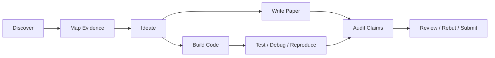

<div align="center">

<picture>
  <source media="(prefers-color-scheme: dark)" srcset="./docs/assets/ucl-masthead-dark-purple.png">
  <source media="(prefers-color-scheme: light)" srcset="./docs/assets/ucl-masthead-off-white.png">
  
</picture>

# UCL-RAI Skills

**A source-grounded skill system for Robotics & AI research and engineering.**

Reusable agent skills for literature search, knowledge onboarding, paper writing, experiment auditing, reviewer response, submission checks, and daily Robotics & AI coding workflows.

[](https://github.com/UCL-RAI/skills/actions/workflows/validate.yml)
[](./LICENSE)
[](./catalog.json)
[](./CONTRIBUTING.md)

[Quickstart](#quickstart) · [Choose a Flow](#choose-a-flow) · [Skill Catalog](#skill-catalog) · [Quality Bar](#quality-bar) · [Contributing](#contributing)

</div>

---

## What This Is

UCL-RAI Skills is a student-led open-source collection of reusable skills for AI coding agents, research assistants, and automation workflows.

The repository is intentionally small at the start. The current catalog contains 22 draft skills that establish the structure, contribution path, validation workflow, and review standards for the first public release.

## At a Glance

| Area | What to expect |
| --- | --- |
| Research workflows | Literature review, experiment tracking, paper writing, reproducibility, and evaluation helpers. |
| Robotics workflows | Simulation, control, hardware bring-up, debugging, and deployment helpers. |
| AI engineering | Dataset preparation, model evaluation, agent workflows, prompt systems, and tooling. |
| Teaching and coursework | Practical templates that are easy to inspect, adapt, and cite. |

## Workflow



Router skills stay thin: they select the right subskills, enforce gates, and name the expected artifacts. Detailed procedures live in focused atomic, reference, or tool skills.

## Choose a Flow

Start from one of the three router skills unless you already know the atomic skill you need.

| User goal | Start here |
| --- | --- |
| Enter a field, build a literature base, plan a survey, or brainstorm a Robotics & AI project. | `rai-research-flow` |
| Outline, revise, audit, or prepare a Robotics & AI conference paper. | `rai-paper-flow` |
| Build, debug, test, or review Robotics & AI research code. | `rai-coding-flow` |

Common routes:

- **Enter a new research area**: `rai-research-flow` -> `knowledge-base-onboarding` / `paper-search-protocol` -> `paper-reading-card` -> `evidence-matrix-builder`
- **Write or revise a paper**: `rai-paper-flow` -> `venue-paper-outline` / `related-work-positioning` / `abstract-introduction-builder` / `citation-integrity-auditor` / `manuscript-structure-auditor` / `scientific-writing-editor` / `scientific-figure-director` / `paper-red-team-review`
- **Audit experiments**: `rai-paper-flow` -> `benchmark-audit` -> `experiment-provenance-auditor`
- **Work on code**: `rai-coding-flow` -> `robotics-ai-coding-flow`
- **Brainstorm a project**: `research-idea-rubric`
- **Check whether citations support claims**: `citation-integrity-auditor`
- **Audit coherence and repetition**: `manuscript-structure-auditor`
- **Edit grammar, clarity, concision, and scientific tone**: `scientific-writing-editor`
- **Write limitations or failure analysis**: `limitations-failure-case-auditor`
- **Get a harsh paper review**: `paper-red-team-review`
- **Respond to reviewers**: `reviewer-response-builder`
- **Check LaTeX/source package before submission**: `latex-submission-checker`

## Skill System

The library is organized as a small research workflow system:

| Layer | Role | Examples |
| --- | --- | --- |
| `flow` | User-invoked orchestration across several skills. | `rai-research-flow`, `rai-paper-flow`, `rai-coding-flow` |
| `atomic` | One concrete repeatable task with a checkable artifact. | `paper-reading-card`, `citation-integrity-auditor` |
| `reference` | Shared rubric or vocabulary used by other skills. | `research-idea-rubric`, `venue-paper-outline` |
| `tool` | Tool-specific workflow or validation protocol. | `scientific-figure-director` |

See [docs/architecture.md](./docs/architecture.md) and [docs/skill-roadmap.md](./docs/skill-roadmap.md) for the design rationale.

## Skill Catalog

The current catalog contains draft skills for the Robotics & AI research lifecycle:

### Core Routers

| Skill | Purpose |
| --- | --- |
| `rai-research-flow` | Route research onboarding, surveys, ideation, writing, figures, and audits. |
| `rai-paper-flow` | Route conference-paper writing, review, rebuttal, and submission preparation. |
| `rai-coding-flow` | Route Robotics & AI coding, debugging, testing, review, and reproducibility work. |

### Discover and Map

| Skill | Purpose |
| --- | --- |
| `knowledge-base-onboarding` | Build a source inventory, concept map, artifact map, and next-action plan. |
| `paper-search-protocol` | Build reproducible search logs. |
| `paper-reading-card` | Create source-grounded single-paper cards. |
| `evidence-matrix-builder` | Build comparison matrices and gap maps. |
| `research-idea-rubric` | Score and refine project ideas. |

### Write and Position

| Skill | Purpose |
| --- | --- |
| `venue-paper-outline` | Plan ICRA/RSS/CoRL/ICML/ICLR/NeurIPS-style papers. |
| `related-work-positioning` | Build source-grounded prior-work clusters and novelty boundaries. |
| `abstract-introduction-builder` | Draft abstracts and introductions from verified problem, gap, method, evidence, and scope. |
| `scientific-writing-editor` | Edit grammar, clarity, concision, scientific tone, and generic AI-style prose patterns without changing technical claims. |
| `scientific-figure-director` | Plan, prompt, and audit scientific figures. |

### Audit and Review

| Skill | Purpose |
| --- | --- |
| `citation-integrity-auditor` | Check whether citations support claims. |
| `manuscript-structure-auditor` | Audit coherence, section flow, repetition, contradictions, and claim threading. |
| `benchmark-audit` | Audit benchmark fit, baselines, metrics, ablations, leakage risk, and claim-result alignment. |
| `experiment-provenance-auditor` | Trace paper results back to code, configs, data, seeds, logs, hardware, and generated artifacts. |
| `limitations-failure-case-auditor` | Audit limitations, assumptions, failure cases, negative results, and deployment risks. |
| `paper-red-team-review` | Perform harsh evidence-grounded paper review. |

### Package and Code

| Skill | Purpose |
| --- | --- |
| `reviewer-response-builder` | Build point-by-point reviewer responses and revision plans. |
| `latex-submission-checker` | Check LaTeX source packages for build, venue, anonymity, arXiv, and submission hygiene. |
| `robotics-ai-coding-flow` | Apply Robotics & AI code quality checks. |

All current skills are `draft` maturity. They are useful as scaffolds and review targets, but should be forward-tested before being treated as stable.

## Repository Map

```text
.
|-- catalog.json                 # Machine-readable registry
|-- catalog.schema.json          # Catalog schema
|-- docs/                        # Architecture, roadmap, and curation policy
|-- examples/                    # Realistic example prompts and artifact shapes
|-- forward-tests/               # Manual forward-test prompts and pass criteria
|-- skills/                      # Published skills
|-- templates/SKILL.md           # Starter template
|-- scripts/                     # Catalog and forward-test validators
|-- .github/workflows/validate.yml
|-- CONTRIBUTING.md
`-- LICENSE
```

## Quickstart

Clone the repository and validate the catalog:

```bash
git clone https://github.com/UCL-RAI/skills.git
cd skills
python scripts/validate_catalog.py
python scripts/validate_forward_tests.py
```

To draft a new skill:

```bash
mkdir -p skills/research/example-skill
cp templates/SKILL.md skills/research/example-skill/SKILL.md
```

Then add the skill metadata to `catalog.json` and run validation again.

See [docs/usage.md](./docs/usage.md) for local skill usage, validation, and forward-testing guidance.

## Quality Bar

- **Executable over decorative.** A good skill should help an agent or human do a concrete task correctly.
- **Small surface area.** Prefer focused skills with clear trigger conditions over large, vague playbooks.
- **Inspectable reasoning.** Include assumptions, constraints, and validation steps where they matter.
- **Research-grade caution.** Do not invent facts, APIs, benchmarks, or citations. Point to primary sources when a skill depends on external knowledge.
- **Reusable by default.** Keep local paths, credentials, and project-specific assumptions out of published skills unless they are explicitly documented.

Every published skill should have clear frontmatter, a catalog entry, completion criteria, and either validation instructions or a forward-test fixture.

## Contributing

Contributions are welcome from UCL Robotics & AI students and the wider community.

Start with [CONTRIBUTING.md](./CONTRIBUTING.md), use [templates/SKILL.md](./templates/SKILL.md), and open a pull request with a short example of when the skill should be used.

## Contributors

- [ylhaichen](https://github.com/ylhaichen)

## Status

This is an early scaffold with 22 draft skills. The next milestone is to forward-test the highest-value skills on realistic Robotics & AI research tasks, tighten the boundaries, and promote selected skills from `draft` to `beta`.

## License

Released under the [MIT License](./LICENSE).
