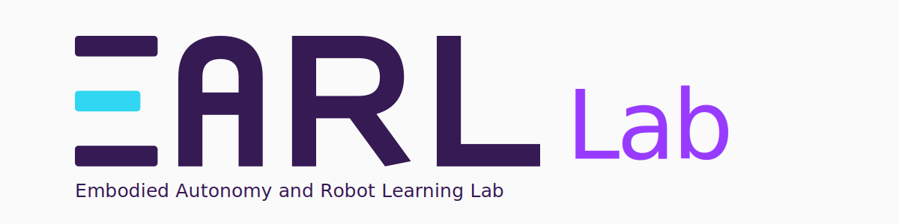
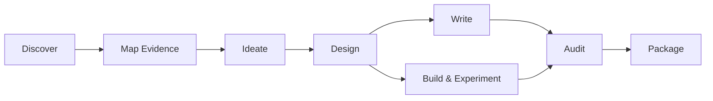

<div align="center">

<picture>
  <source media="(prefers-color-scheme: dark)" srcset="./docs/assets/earl/masthead-dark.svg">
  <source media="(prefers-color-scheme: light)" srcset="./docs/assets/earl/masthead-light.svg">
  
</picture>

# EARL Research Skills

**An open-source research operating system for Robotics & AI.**

Developed and maintained by **EARL Lab** within **UCL Robotics & AI**.

[](https://github.com/UCL-EARL/skills/actions/workflows/validate.yml)
[](./LICENSE)
[](./docs/catalog.md)
[](./forward-tests/)

[Get Started](#get-started) | [Flagship Workflows](#flagship-workflows) | [System Design](#system-design) | [Catalog](./docs/catalog.md) | [Contribute](#contribute)

</div>

## What This Is

EARL Research Skills is a public, composable skill system for AI coding agents and research assistants. It connects literature discovery, evidence synthesis, research planning, remote experiments, paper writing, scientific review, submission, and Robotics & AI engineering into inspectable workflows.

This is not a prompt dump. Each skill has a defined trigger, procedure, output artifact, completion criteria, catalog entry, and validation path.

## Flagship Workflows

### Literature to Research Direction

```text
rai-research-flow
  -> paper-search-protocol
  -> paper-reading-card
  -> evidence-matrix-builder
  -> research-idea-rubric / survey-synthesis-builder
```

Build a reproducible literature base, compare evidence, identify defensible gaps, and turn the result into a research direction or survey structure.

### Experiments to Paper

```text
experiment-dossier-builder
  -> paper-code-consistency-auditor
  -> paper-draft-builder
  -> scientific-figure-director
```

Package remote code and experiment results into a portable dossier, verify manuscript-code consistency, and construct a source-grounded paper narrative.

### Paper to Submission

```text
rai-paper-flow
  -> manuscript-structure-auditor
  -> citation-integrity-auditor
  -> paper-red-team-review
  -> reviewer-response-builder / latex-submission-checker
```

Audit logic, citations, evidence, scientific writing, reviewer risk, rebuttal commitments, and submission readiness without changing technical claims silently.

Robotics and AI code work is routed through `rai-coding-flow` and `robotics-ai-coding-flow`, with explicit checks for debugging, experiments, reproducibility, and deployment risk.

## Research Lifecycle



Router skills select the minimum useful path. Atomic skills perform focused tasks. Reference skills supply shared standards. Tool skills add output-specific protocols and validation.

## Get Started

Clone the repository and validate the system:

```bash
git clone https://github.com/UCL-EARL/skills.git
cd skills
python scripts/validate_catalog.py
python scripts/validate_forward_tests.py
```

Install the skill directories using the mechanism supported by your agent client, then invoke a router or atomic skill by name. Start with:

| Goal | Entry point |
| --- | --- |
| Enter a research area or plan a survey | `rai-research-flow` |
| Draft, revise, or audit a paper | `rai-paper-flow` |
| Work on Robotics & AI code | `rai-coding-flow` |
| Move remote experiments into local writing | `experiment-dossier-builder` |
| Stress-test an ambiguous plan | `research-plan-grill` |

See [docs/usage.md](./docs/usage.md) for installation patterns, invocation examples, paper modes, and forward-testing guidance.

## Daily Paper Modes

`rai-paper-flow` supports three levels of effort:

| Mode | Use it for | Expected behavior |
| --- | --- | --- |
| `quick` | Daily edits and blocker triage | Identify the top issues, make focused repairs, and recommend one next pass. |
| `standard` | Normal multi-section revision | Audit structure, evidence, citations, and prose without running every possible check. |
| `deep` | Submission, rebuttal, or high-risk review | Produce full audit ledgers, provenance checks, residual risks, and explicit blockers. |

The default is `quick`. Heavier modes are opt-in so routine research work stays efficient.

## Capability Map

| Area | Capabilities |
| --- | --- |
| Discover and map | Knowledge onboarding, reproducible search, paper reading cards, evidence matrices, survey synthesis. |
| Plan and position | Research grilling, idea evaluation, related-work positioning, venue-aware outlines. |
| Write and communicate | Abstracts, introductions, paper drafts, scientific editing, figures, research talks. |
| Audit and review | Citations, benchmarks, provenance, paper-code consistency, limitations, red-team review. |
| Package and respond | Reviewer responses, LaTeX submission checks, portable experiment dossiers. |
| Engineer | Robotics & AI coding, debugging, testing, experiment hygiene, and reproducibility. |

Browse all 28 skills in the [Skill Catalog](./docs/catalog.md).

## System Design

| Layer | Responsibility |
| --- | --- |
| `flow` | Route work across skills, enforce gates, and name expected artifacts. |
| `atomic` | Complete one repeatable task with a checkable output. |
| `reference` | Provide shared rubrics, vocabulary, or venue and domain standards. |
| `tool` | Apply a tool or output-medium protocol and validate the result. |

The `rai-*` prefix means **Robotics & AI**. These stable skill IDs describe the domain and are independent of repository ownership.

Read [docs/architecture.md](./docs/architecture.md), [docs/curation-policy.md](./docs/curation-policy.md), [docs/quality-rubric.md](./docs/quality-rubric.md), and [docs/brand-assets.md](./docs/brand-assets.md) for the full design, acceptance rules, and public identity contract.

## Quality and Status

- Source-grounded claims: do not invent citations, benchmarks, APIs, or experimental results.
- Checkable completion: every skill must define what finished work looks like.
- Narrow boundaries: prefer focused skills and thin routers over mega-skills.
- Public reuse: no credentials, private paths, restricted data, or undocumented services.
- Inspectable provenance: record external inspiration without copying third-party prose.

The catalog currently contains 28 `draft` skills and 20 forward-test fixtures. `draft` is an explicit maturity label, not a claim of production stability. Skills move to `beta` or `stable` only when supported by realistic use evidence under the [quality rubric](./docs/quality-rubric.md).

## Repository Map

```text
.
|-- catalog.json                 # Machine-readable registry
|-- catalog.schema.json          # Catalog schema
|-- docs/                        # Architecture, catalog, policies, and usage
|-- examples/                    # Inspectable examples and artifact shapes
|-- forward-tests/               # Manual forward-test prompts and pass criteria
|-- skills/                      # Published skills
|-- templates/SKILL.md           # Skill authoring template
|-- scripts/                     # Catalog and forward-test validators
`-- .github/                     # CI, ownership, and contribution workflows
```

## About EARL Lab

**EARL Lab** is an Embodied Autonomy and Robot Learning research group within **UCL Robotics & AI at University College London**. Its research focuses on:

- **Embodied Autonomy**: perception, reasoning, planning, and action under real-world uncertainty.
- **Generalizable Robot Learning**: transferable, composable, and continually improving robot skills.
- **Foundation Models for Robotics**: VLA models, multimodal models, and embodied agents for robotic learning and evaluation.

Rigorous evaluation, reproducibility, and open-source research are shared principles across these directions.

## Contribute

EARL Research Skills accepts public issues, discussions, and pull requests. External contribution is open; roadmap, scope, quality standards, releases, and maintainer appointments remain governed by EARL Lab.

Read [CONTRIBUTING.md](./CONTRIBUTING.md), [GOVERNANCE.md](./GOVERNANCE.md), and [CODE_OF_CONDUCT.md](./CODE_OF_CONDUCT.md) before contributing.

## Contributors

Current contributors are recorded in [CONTRIBUTORS.md](./CONTRIBUTORS.md) according to their actual work.

## License

Released under the [MIT License](./LICENSE).
